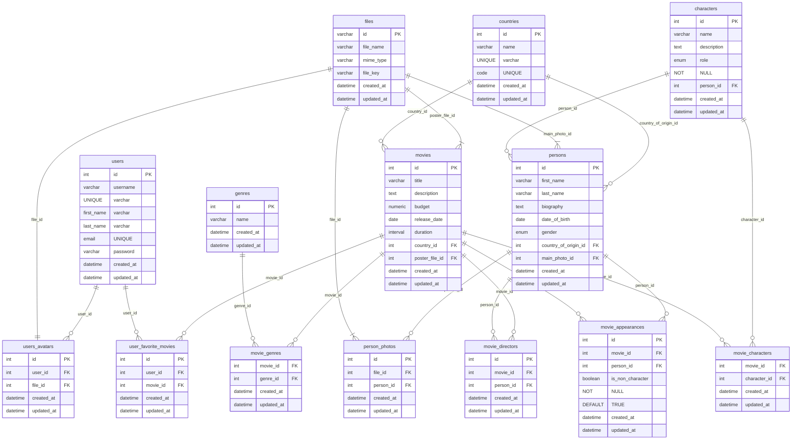

# BSA-08-Database-and-SQL

## Overview

This project sets up a PostgreSQL container and executes SQL scripts to demonstrate querying and data manipulation. The database is populated with a small dataset for testing purposes (no humans were harmed in the making of this dataset).

### Script to prepare database structure

[00-create-all-tables.sql](queries-create_tables%2F00-create-all-tables.sql)

### Scripts according to tasks

[queries](queries)

### To check:

```bash
 ./run_queries.sh
 
 ```

Wait for the container to start.

Check the output.log file for results:
```
cat output.log
```
## DB Structure 
# Database Schema Diagram

